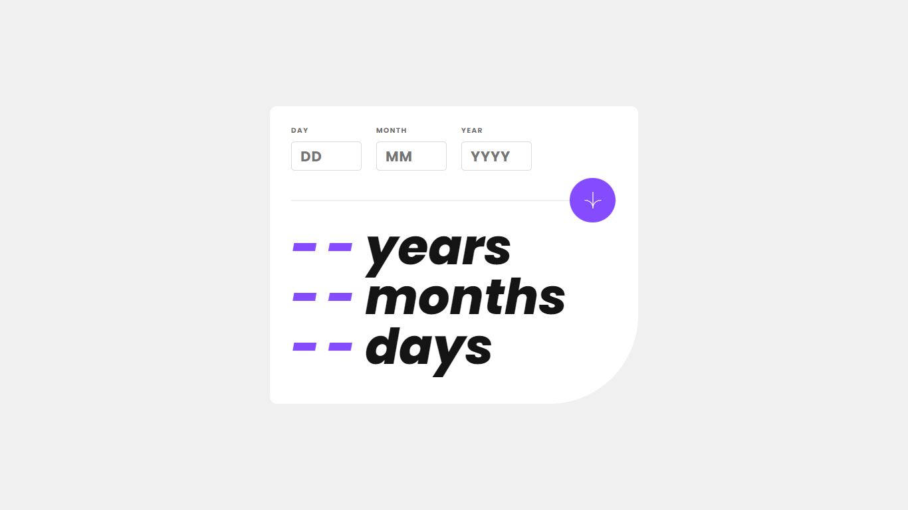
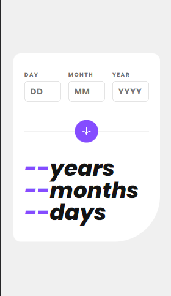

## Welcome! 👋

This is a solution to the [Age calculator app challenge on Frontend Mentor](https://www.frontendmentor.io/challenges/age-calculator-app-dF9DFFpj-Q).

## Table of contents

- [Overview](#overview)
  - [The challenge](#the-challenge)
  - [Screenshot](#screenshot)
- [My process](#my-process)
  - [Built with](#built-with)
  - [What I learned](#what-i-learned)
- [Author](#author)

## Overview

This is a simple Age Calculator web application built using HTML and JavaScript. It allows users to input their birth date and calculates their age in years, months, and days.

### The challenge

Your challenge is to build out this age calculator app and get it looking as close to the design as possible.

You can use any tools you like to help you complete the challenge. So if you've got something you'd like to practice, feel free to give it a go.

Your users should be able to:

- View an age in years, months, and days after submitting a valid date through the form
- Receive validation errors if:
  - Any field is empty when the form is submitted
  - The day number is not between 1-31
  - The month number is not between 1-12
  - The year is in the future
  - The date is invalid e.g. 31/04/1991 (there are 30 days in April)
- View the optimal layout for the interface depending on their device's screen size
- See hover and focus states for all interactive elements on the page
- **Bonus**: See the age numbers animate to their final number when the form is submitted

### Screenshot

### Links

- [Solution URL](https://github.com/TerminalEagle/FrontEndMentor-Challenges/tree/master/age-calculator-app-main)
- [Live Site URL](https://genuine-ganache-5be36e.netlify.app/)

## My process

The Age Calculator app is implemented using HTML, CSS, and JavaScript. The main components of the code are as follows:

- The HTML code defines the structure of the app, including input fields, error messages, and the result display section.

- The CSS code (`style.css`) contains the styles and layout for the app interface.

- The JavaScript code (`script.js`) handles the logic of the app. It includes a `Calculator` class that encapsulates the age calculation and validation functions.

- The `Calculator` class performs the following tasks:
  - Checks for leap years to ensure accurate age calculation.
  - Validates the user input for the day, month, and year.
  - Resets error messages and clears the result display when needed.
  - Retrieves the user input values from the input fields.
  - Calculates the age based on the provided birth date and the current date.
  - Updates the result display with the calculated age.

### Built with

- Semantic HTML5 markup
- CSS custom properties
- Vanilla JavaScript
- Mobile-first workflow

### What I learned

Code accessible by using the `aria`, `role` labels in the code for containers which inherently do not have a semantic meaning.

## Author

- Frontend Mentor - [@TerminalEagle](https://www.frontendmentor.io/profile/TerminalEagle)
